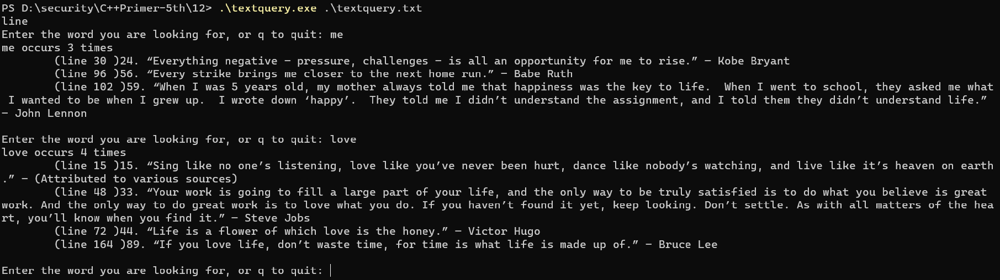

# TextQuery
TextQuery is a small demo of using smart pointer and c++ standard library. You can use it to find word in a file.

## compile

```
 g++ .\textquery.cpp .\queryresult.cpp .\textQueryMain.cpp -o .\textquery
```

## usage

```
.\textquery filename
```

## demo


